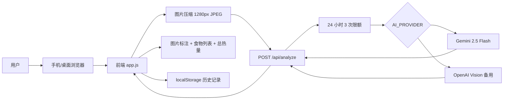

# Calorie Lens 产品开发文档

## 1. 文档目的

本文档用于指导 Calorie Lens 的产品开发、技术实现、联调测试和后续迭代。需求范围以 `docs/requirements.md` 为准，本文档重点说明工程结构、模块职责、接口设计、运行配置、测试方案和上线演进路线。

## 2. 当前技术栈

- 前端：原生 HTML、CSS、JavaScript。
- 后端：Node.js 原生 `http` 服务。
- AI 模型：默认 Gemini 2.5 Flash，备用 OpenAI Vision。
- 数据存储：
  - 浏览器 `localStorage`：用户本机 ID、历史记录。
  - 本地 `.analysis-usage.json`：24 小时调用次数记录。
  - `.env`：本地 API Key 和服务配置。
- 部署形态：当前为本地原型服务，入口为 `node server.js`。

## 3. 目录结构

```text
Calorie Track/
  index.html              # App 主页面
  styles.css              # 页面样式
  app.js                  # 前端交互、图片压缩、状态管理
  server.js               # 静态服务、AI API 代理、限额控制
  manifest.json           # PWA 基础配置
  README.md               # 运行和配置说明
  .env.example            # 环境变量模板
  .gitignore              # 忽略密钥、本地用量和日志
  docs/
    requirements.md       # 产品需求文档
    development.md        # 产品开发文档
```

## 4. 系统架构



## 5. 前端模块设计

### 5.1 页面结构

`index.html` 包含两个主要区域：

- `camera-panel`：相机、图片预览、食物区域、拳头参照区域、拍照和上传入口。
- `analysis-panel`：总热量、总重量、置信度、分析按钮、食物列表、拳头体积滑块和历史记录。

### 5.2 状态管理

前端状态集中在 `state` 对象：

```js
{
  stream: null,
  hasPhoto: false,
  photoDataUrl: "",
  clientId: "...",
  fistVolumeMl: 350,
  foods: [],
  history: []
}
```

关键字段说明：

- `stream`：当前摄像头流。
- `hasPhoto`：是否已有待分析图片。
- `photoDataUrl`：压缩后的图片 data URL。
- `clientId`：本机用户标识，存储在 `localStorage`。
- `fistVolumeMl`：拳头参照体积。
- `foods`：当前分析或手动录入的食物列表。
- `history`：本地历史记录。

### 5.3 图片处理

前端在 `compressImageDataUrl()` 中完成压缩：

- 读取图片。
- 将最长边限制为 `1280px`。
- 输出 `image/jpeg`。
- JPEG 质量为 `0.82`。

这样可以减少 API 请求体积、降低模型输入成本，并提升分析速度。

### 5.4 新图清理逻辑

当用户拍照或上传新图片时，必须调用 `clearAnalysisForNewPhoto()`：

- 清空 `foods`。
- 清空旧图片数据。
- 清空图片标注。
- 重置总热量和总重量。
- 更新置信度状态。

这可以避免上一张图片的识别标注残留到新图片上。

### 5.5 食物编辑

每个食物项支持：

- 修改食物名称。
- 修改克重。
- 修改 `kcal/100g`。
- 删除。
- 图片标注拖动。

修改后通过 `renderTotals()` 和 `renderOverlay()` 实时同步总热量和图片标注。

## 6. 后端模块设计

### 6.1 静态文件服务

`server.js` 使用 Node 原生 `http` 模块提供静态文件：

- `/` 映射到 `index.html`。
- `.html`、`.css`、`.js`、`.json` 设置对应 content type。
- 防止访问项目目录外文件。

### 6.2 环境变量加载

服务启动时按顺序读取：

1. `.env`
2. `.env.local`

如果某个变量已经存在于系统环境变量中，本地文件不会覆盖它。

### 6.3 分析接口

接口：

```http
POST /api/analyze
Content-Type: application/json
```

请求体：

```json
{
  "clientId": "local-user-id",
  "fistVolumeMl": 350,
  "imageDataUrl": "data:image/jpeg;base64,..."
}
```

成功响应：

```json
{
  "foods": [
    {
      "name": "米饭",
      "grams": 180,
      "kcalPer100g": 116,
      "confidence": 0.72,
      "position": {
        "left": 18,
        "top": 28
      },
      "notes": "基于图片估算"
    }
  ],
  "overallConfidence": 0.68,
  "usedFistReference": true,
  "message": "识别完成，请检查重量。",
  "provider": "gemini",
  "model": "gemini-2.5-flash",
  "remaining": 2
}
```

错误响应：

```json
{
  "error": "错误说明"
}
```

常见状态码：

- `400`：请求格式错误、缺少用户标识、图片格式错误。
- `429`：超过 24 小时分析次数限制。
- `501`：未配置 API Key。
- `500`：模型调用失败或返回无法解析。

### 6.4 限额控制

限额逻辑：

- 使用 `clientId` 作为本机用户标识。
- `DAILY_ANALYSIS_LIMIT` 默认值为 `3`。
- 时间窗口为 24 小时滚动窗口。
- 用量记录保存在 `.analysis-usage.json`。
- 请求成功完成 AI 分析后才记录一次用量。

当前限制属于本地原型级别。正式上线后应迁移到数据库或 Redis，并基于账号、设备、IP 或订阅状态进行限额。

### 6.5 AI Provider

后端通过 `AI_PROVIDER` 切换模型提供方：

```text
AI_PROVIDER=gemini
```

可选值：

- `gemini`
- `openai`

默认使用 Gemini。

## 7. Gemini 接入设计

### 7.1 配置

```text
AI_PROVIDER=gemini
GEMINI_API_KEY=your-gemini-api-key-here
GEMINI_MODEL=gemini-2.5-flash
```

### 7.2 请求方式

服务端调用 Gemini `generateContent` 接口：

```text
https://generativelanguage.googleapis.com/v1beta/models/gemini-2.5-flash:generateContent
```

请求内容包括：

- 文本 prompt。
- 图片 `inline_data`。
- `response_mime_type: application/json`。
- `response_schema`，要求模型返回结构化 JSON。

### 7.3 返回解析

服务端从 Gemini 响应中读取文本内容，并解析为 JSON。解析后通过 `clampFood()` 做防御性修正：

- 食物名称限制长度。
- 克重最小为 1。
- `kcalPer100g` 最小为 1。
- `confidence` 限制在 0 到 1。
- 标注位置限制在 2 到 88。

## 8. OpenAI 备用接入

当配置：

```text
AI_PROVIDER=openai
OPENAI_API_KEY=sk-...
OPENAI_MODEL=gpt-4.1-mini
```

服务端会调用 OpenAI Responses API，并使用 JSON schema 要求结构化输出。

OpenAI 通道主要用于：

- Gemini 不可用时备用。
- 对比不同视觉模型的识别准确率。
- 后续做模型 A/B 测试。

## 9. Prompt 设计

当前 prompt 目标：

- 明确模型角色是营养识别助手。
- 强调结果是估算，不是绝对准确。
- 要求尽量拆分盘中每个独立食物。
- 如果看到拳头，应使用拳头体积作为参照。
- 要求返回克重、热量密度、置信度、标注位置和备注。
- 对无法确定的项目给低置信度并提醒用户手动调整。

后续优化方向：

- 加入更多中文食物名称映射。
- 根据地区饮食习惯切换 prompt。
- 将模型识别食物名映射到营养数据库标准名。
- 为米饭、面食、肉类、蔬菜分别提供估算规则。

## 10. 本地运行

### 10.1 安装要求

- Node.js 18 或更高版本。
- 现代浏览器。
- Gemini API Key。

### 10.2 配置

复制 `.env.example` 为 `.env`，填入：

```text
AI_PROVIDER=gemini
GEMINI_API_KEY=your-gemini-api-key-here
GEMINI_MODEL=gemini-2.5-flash
DAILY_ANALYSIS_LIMIT=3
PORT=4173
```

### 10.3 启动

```bash
node server.js
```

访问：

```text
http://127.0.0.1:4173
```

### 10.4 重启

修改 `.env` 后必须重启服务，否则旧环境变量仍会继续生效。

## 11. 测试方案

### 11.1 静态检查

```bash
node --check app.js
node --check server.js
```

### 11.2 手动功能测试

- 打开首页，确认页面正常加载。
- 点击“上传照片”，确认打开相册或文件选择器。
- 上传新图片，确认旧标注被清空。
- 点击“分析照片”，确认返回食物列表。
- 修改克重，确认总热量实时变化。
- 修改 `kcal/100g`，确认食物热量实时变化。
- 拖动图片标注，确认位置更新。
- 点击“保存记录”，确认历史记录出现。
- 连续分析 4 张图片，确认第 4 次返回限额错误。

### 11.3 API 测试

示例请求：

```bash
curl -X POST http://127.0.0.1:4173/api/analyze \
  -H "Content-Type: application/json" \
  -d "{\"clientId\":\"test-user\",\"fistVolumeMl\":350,\"imageDataUrl\":\"data:image/jpeg;base64,...\"}"
```

预期：

- 配置正确时返回 `200`。
- 缺少 `clientId` 返回 `400`。
- 超过限制返回 `429`。
- 未配置 Key 返回 `501`。

## 12. 错误处理策略

前端：

- 图片读取失败：弹窗提示。
- 模型调用失败：弹窗提示，并展示模拟结果。
- 无图片分析：提示先拍照或上传照片。
- 新图处理时：禁用分析按钮，避免重复提交。

后端：

- 请求体超过限制：拒绝请求。
- JSON 解析失败：返回 `400`。
- 图片 data URL 格式错误：返回 `400`。
- API Key 未配置：返回 `501`。
- 模型返回错误：转为错误响应。
- 模型输出异常：返回 `500`。

## 13. 数据与隐私

当前版本：

- 不上传 API Key 到 GitHub。
- 不保存用户照片到服务器文件系统。
- 图片只在请求过程中传给模型服务。
- 历史记录保存在浏览器本地。
- 限额记录只保存 `clientId` 和时间戳。

上线前需要补充：

- 隐私政策。
- 用户授权说明。
- 图片保留策略。
- 第三方模型服务数据处理说明。
- 用户删除数据能力。

## 14. 安全要求

- `.env` 不得提交到 Git。
- `.analysis-usage.json` 不得提交到 Git。
- 前端不得出现任何 API Key。
- 生产环境应使用 HTTPS。
- 生产环境应增加身份认证和服务端鉴权。
- 生产环境应限制 CORS 来源。
- 生产环境应增加请求频控和异常监控。

## 15. 部署演进

### 15.1 当前本地原型

- 单 Node 进程。
- 本地文件存储限额。
- 浏览器本地历史。

### 15.2 MVP 云端版本

- 前端部署到静态托管。
- 后端部署到 Node 服务或 serverless。
- 用数据库保存用户和历史记录。
- 用 Redis 或数据库实现限额。
- API Key 放到云环境变量。

### 15.3 商业化版本

- 增加用户登录。
- 增加订阅套餐。
- 分析次数与套餐绑定。
- 增加营养数据库。
- 增加多模型评估和自动降级。
- 增加后台运营面板。

## 16. 开发任务拆分

### 16.1 已完成

- 基础拍照和上传界面。
- 图片压缩。
- Gemini API 接入。
- OpenAI 备用接入。
- 24 小时 3 次分析限制。
- 多食物标注和列表展示。
- 食物重量和热量密度编辑。
- 图片标注拖动。
- 历史记录。

### 16.2 下一阶段

- 引入专业营养数据库。
- 增加蛋白质、脂肪、碳水估算。
- 增加账号系统。
- 将历史记录迁移到后端。
- 将限额迁移到数据库或 Redis。
- 增加错误日志和用量统计。
- 增加模型识别反馈机制。

## 17. 质量门槛

每次发布前至少完成：

- `node --check app.js`
- `node --check server.js`
- 桌面浏览器上传图片测试。
- 手机浏览器拍照测试。
- Gemini API 真实调用测试。
- 第 4 次分析限额测试。
- Git 检查确认 `.env` 未被跟踪。

## 18. 关键风险

- 单张照片难以精确估算体积和重量。
- 拳头参照物大小存在个体差异。
- 模型可能误识别混合菜。
- 营养热量数据库缺失会影响准确率。
- 免费或低价 API 可能有速率限制。
- 本地限额容易被清浏览器数据绕过。

## 19. 决策记录

- 默认模型选择 Gemini 2.5 Flash，原因是成本较低、视觉能力较好、适合 MVP。
- 保留 OpenAI 作为备用，便于后续对比识别效果。
- 前端压缩图片，原因是降低成本和提高响应速度。
- 先做手动校正，原因是食物重量估算天然不稳定。
- 当前限额按本机用户实现，原因是原型阶段没有账号系统。
